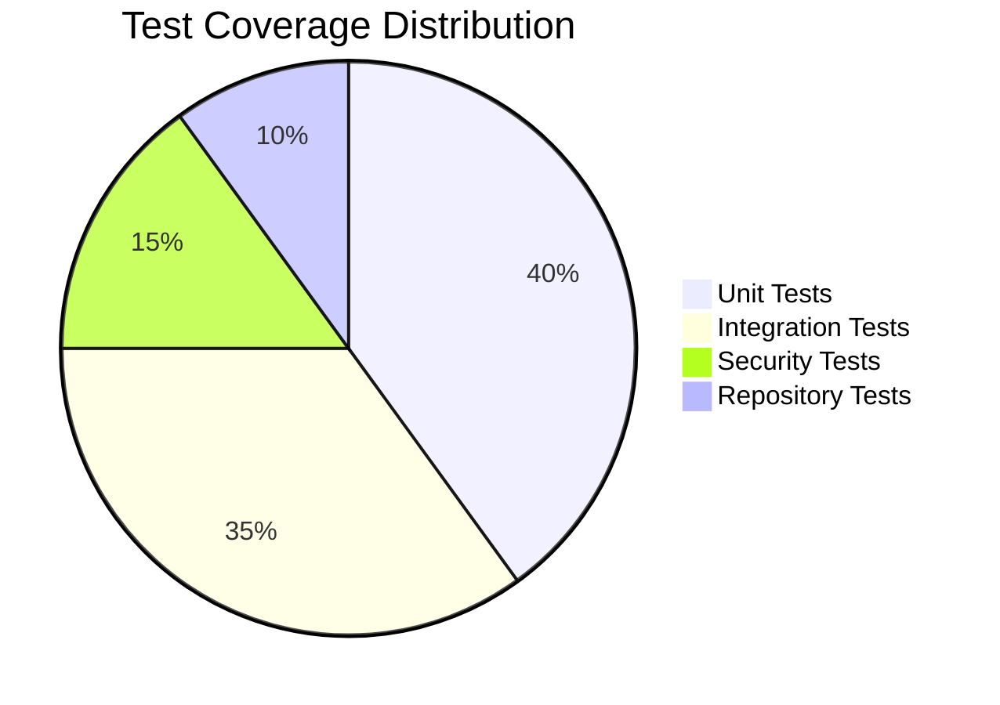
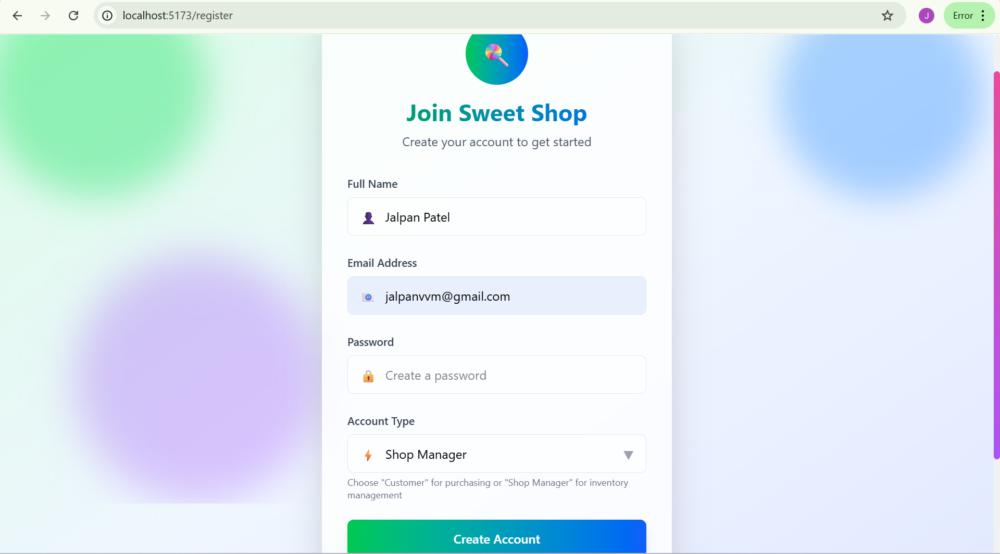
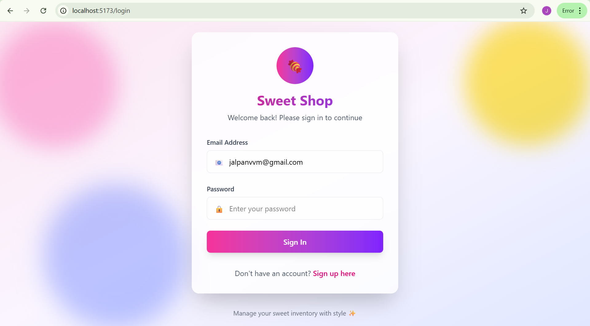
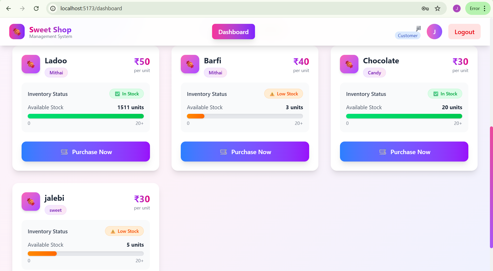
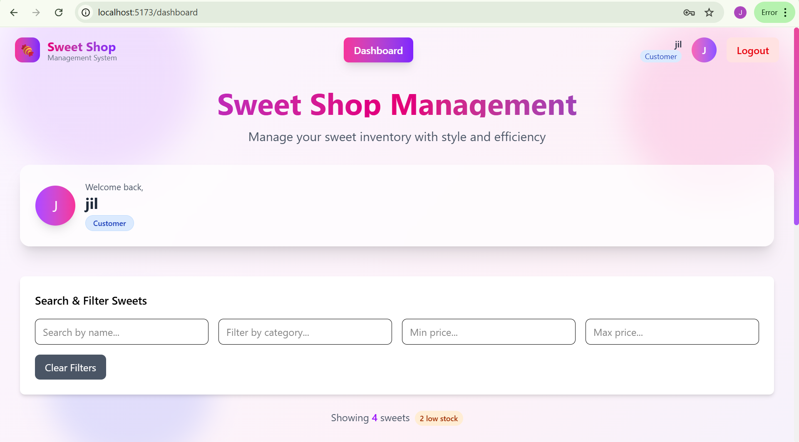
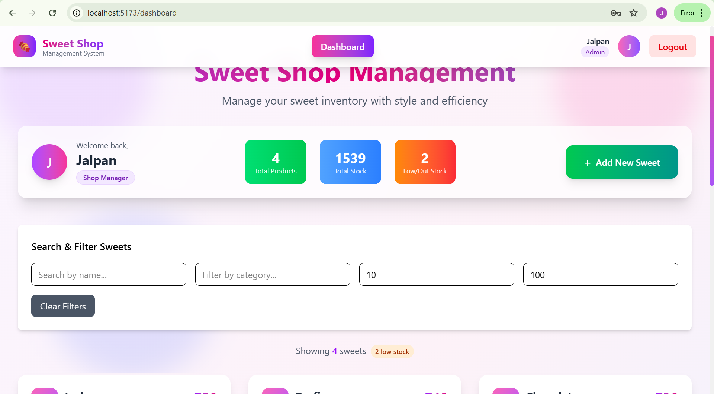
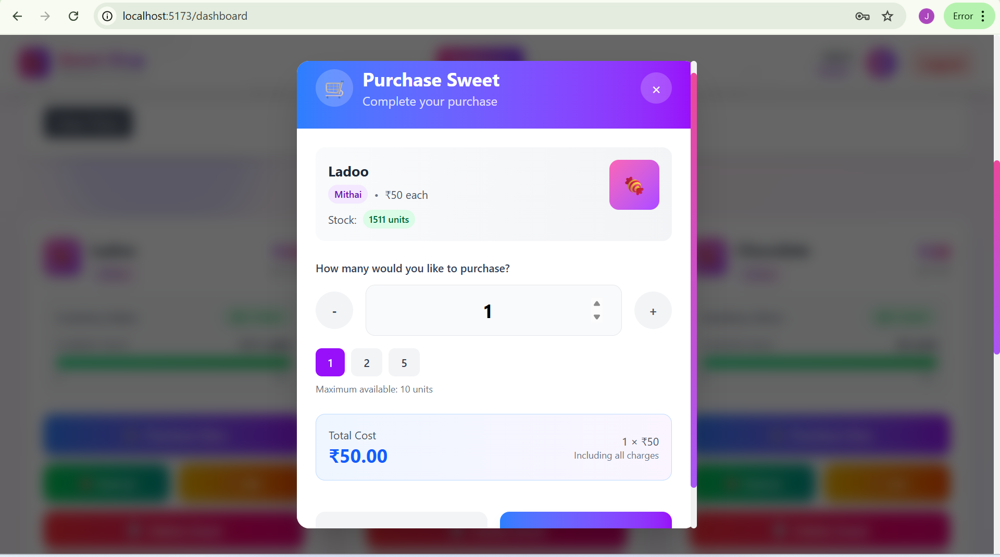
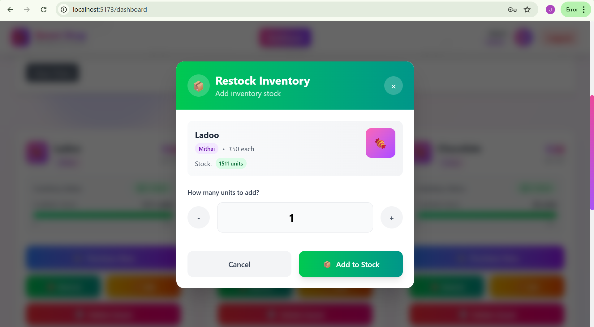

# 🍭 Sweet Shop Management System

<div align="center">

A full-stack web application for managing a sweet shop's inventory, user authentication, and purchase operations. Built following Test-Driven Development (TDD) principles with modern technologies.


**Live Frontend Application:** [https://incubyte-f.vercel.app/](https://incubyte-f.vercel.app/)  
*(Note: Backend is not deployed, so signup and signin will not work)*

---

</div>

## 📋 Table of Contents

<div align="center">

| 🎯 [Overview](#-overview) | ✨ [Features](#-features) | 🛠️ [Tech Stack](#-technology-stack) | 📁 [Structure](#-project-structure) |
|:---:|:---:|:---:|:---:|
| **🚀 [Setup](#-getting-started)** | **📚 [API Docs](#-api-documentation)** | **🧪 [Testing](#-testing)** | **☁️ [Deploy](#-deployment)** |
| **📸 [Screenshots](#-screenshots)** | **🤖 [AI Usage](#-my-ai-usage)** | **🤝 [Contributing](#-contributing)** | **📞 [Contact](#-contact)** |

</div>

---

## 🎯 Overview

<div align="center">

> **Where technology meets confectionery excellence**

</div>

The **Sweet Shop Management System** is a comprehensive solution for managing sweet shop operations. It provides user authentication, inventory management, search functionality, and purchase operations with role-based access control for administrators.

<div align="center">


</div>

---

## ✨ Features

<div align="center">


</div>

<table>
<tr>
<td width="50%">

### 🔐 **Authentication & Authorization**
- User registration and login
- JWT-based token authentication
- Role-based access control (Admin/User)
- Secure password handling

### 🍬 **Sweet Management**
- Add new sweets to inventory
- View all available sweets
- Search and filter by name, category, or price range
- Update sweet details
- Delete sweets (Admin only)

</td>
<td width="50%">

### 📦 **Inventory Management**
- Purchase sweets with quantity tracking
- Restock functionality (Admin only)
- Real-time inventory updates
- Out-of-stock handling

### 🎨 **User Interface**
- Responsive modern design
- Intuitive user experience
- Real-time updates
- Mobile-friendly interface

</td>
</tr>
</table>

---

---

## 🛠 Technology Stack

<div align="center">

### Backend Powerhouse


### Frontend Excellence


### Development Tools


</div>

---

## 📁 Project Structure

```
sweetshop-management-system/
├── backend/                    # Spring Boot backend application
│   ├── src/
│   │   ├── main/
│   │   │   ├── java/
│   │   │   │   └── com/sweetshop/
│   │   │   │       ├── controller/     # REST Controllers
│   │   │   │       ├── service/        # Business Logic
│   │   │   │       ├── repository/     # Data Access Layer
│   │   │   │       ├── entity/         # JPA Entities
│   │   │   │       ├── dto/            # Data Transfer Objects
│   │   │   │       ├── config/         # Configuration Classes
│   │   │   │       └── security/       # Security Configuration
│   │   │   └── resources/
│   │   │       └── application.properties
│   │   └── test/                       # JUnit Tests
│   ├── pom.xml
│   └── README.md
├── frontend/                   # React frontend application
│   ├── src/
│   │   ├── components/         # React Components
│   │   ├── pages/             # Page Components
│   │   ├── services/          # API Services
│   │   ├── utils/             # Utility Functions
│   │   ├── styles/            # CSS Styles
│   │   └── App.js
│   ├── package.json
│   └── README.md
└── README.md                  # Project Documentation
```

---

## 🚀 Getting Started

### 📋 Prerequisites

<div align="center">

| Technology | Version | Status |
|:----------:|:-------:|:------:|
| ☕ Java | 17+ | ✅ Required |
| 🟢 Node.js | 16+ | ✅ Required |
| 🐬 MySQL | 8.0+ | ✅ Required |
| 📦 Maven | 3.6+ | ✅ Required |
| 📂 Git | Latest | ✅ Required |

</div>

### 🔧 Backend Setup

```bash
# 📥 Clone the repository
git clone https://github.com/Jalpan25/sweetshop-management-system.git
cd sweetshop-management-system/backend

# 🗄️ Configure MySQL Database
mysql -u root -p
CREATE DATABASE sweetshop_db;

# ⚙️ Update application.properties
# Database Configuration
spring.datasource.url=jdbc:mysql://localhost:3306/sweetshop_db
spring.datasource.username=your_username
spring.datasource.password=your_password

# JWT Configuration
jwt.secret=your_jwt_secret_key
jwt.expiration=86400000

# JPA Configuration
spring.jpa.hibernate.ddl-auto=update
spring.jpa.show-sql=true

# 🚀 Install dependencies and run
mvn clean install
mvn spring-boot:run

# 🎉 Backend is live at http://localhost:8080
```

### 🎨 Frontend Setup

```bash
# 📁 Navigate to frontend directory
cd ../frontend

# 📦 Install dependencies
npm install

# 🌍 Configure API base URL (.env file)
REACT_APP_API_BASE_URL=http://localhost:8080/api

# 🚀 Start the development server
npm start

# 🎉 Frontend is live at http://localhost:3000
```

---

## 📚 API Documentation

### 🔐 Authentication Endpoints

<div align="center">

| Method | Endpoint | Description |
|:------:|:---------|:------------|
| 🟡 POST | `/api/auth/register` | Register a new user |
| 🔵 POST | `/api/auth/login` | User login |

</div>

### 🍬 Sweet Management Endpoints (Protected)

<div align="center">

| Method | Endpoint | Description | Admin Only |
|:------:|:---------|:------------|:----------:|
| 🟢 GET | `/api/sweets` | Get all sweets | ❌ |
| 🟢 GET | `/api/sweets/search` | Search sweets | ❌ |
| 🟡 POST | `/api/sweets` | Add new sweet | ✅ |
| 🔵 PUT | `/api/sweets/{id}` | Update sweet | ✅ |
| 🔴 DELETE | `/api/sweets/{id}` | Delete sweet | ✅ |

</div>

### 📦 Inventory Endpoints (Protected)

<div align="center">

| Method | Endpoint | Description | Admin Only |
|:------:|:---------|:------------|:----------:|
| 🟡 POST | `/api/sweets/{id}/purchase` | Purchase sweet | ❌ |
| 🟡 POST | `/api/sweets/{id}/restock` | Restock sweet | ✅ |

</div>

### 🎨 Example API Requests

<table>
<tr>
<td width="50%">

**Register User:**
```json
POST /api/auth/register
{
    "username": "john_doe",
    "email": "john@example.com",
    "password": "securepassword",
    "role": "USER"
}
```

</td>
<td width="50%">

**Add Sweet:**
```json
POST /api/sweets
Authorization: Bearer <jwt_token>
{
    "name": "Chocolate Truffle",
    "category": "Chocolate",
    "price": 25.99,
    "quantity": 100,
    "description": "Premium truffles"
}
```

</td>
</tr>
</table>

---

## 🧪 Testing

<div align="center">

### Test-Driven Development Excellence

*Following the Red-Green-Refactor TDD cycle*

</div>

### 🚀 Running Tests

<div align="center">

| Command | Description | Output |
|:-------:|:------------|:-------|
| `mvn test` | Run all backend tests | Comprehensive test results |
| `mvn surefire-report:report` | Generate test report | HTML report in `/target/site/` |

</div>

### 📊 Test Coverage

<div align="center">



</div>

<table>
<tr>
<td width="50%">

- **Unit Tests:** Service layer business logic
- **Integration Tests:** API endpoints with database

</td>
<td width="50%">

- **Security Tests:** Authentication and authorization
- **Repository Tests:** Data access layer

</td>
</tr>
</table>

**Test Report:** `backend/target/site/surefire-report.html`

---

## 🚀 Deployment

### 🎨 Frontend Deployment ✅

<div align="center">

[](https://incubyte-f.vercel.app/)

**Live Frontend Application - Click to View Interface**  
*(Note: Backend is not deployed, so signup and signin will not work)*

</div>

---

## 📸 Screenshots

<div align="center">


</div>

### 🔐 Authentication Pages
<div align="center">
<table>
<tr>
<td width="50%">


*User registration with form validation*

</td>
<td width="50%">


*Secure user authentication*

</td>
</tr>
</table>
</div>

### 🏠 Customer Dashboard
<div align="center">
<table>
<tr>
<td width="50%">


*Main customer dashboard showing available sweets*

</td>
<td width="50%">


*Enhanced customer view with sweet categories*

</td>
</tr>
</table>
</div>

### 👑 Admin Panel
<div align="center">


*Administrative interface for managing inventory*

</div>

### 🛒 Purchase & Inventory Management
<div align="center">
<table>
<tr>
<td width="50%">


*Sweet purchase with quantity management*

</td>
<td width="50%">


*Admin restock functionality for inventory management*

</td>
</tr>
</table>
</div>

---

---

## 🤖 My AI Usage

<div align="center">


> **Transparency, collaboration, and innovation at every step**

</div>

### 🛠️ AI Tools Arsenal

<div align="center">

| AI Assistant | Primary Use | Rating | Best For |
|:------------:|:-----------|:------:|:---------|
| **ChatGPT** | Code Generation & Debugging | ⭐⭐⭐⭐⭐ | Boilerplate & Problem Solving |
| **Claude AI** | Architecture & Documentation | ⭐⭐⭐⭐⭐ | System Design & Writing |

</div>

### 🎯 How AI Transformed Development

<table>
<tr>
<td width="50%">

#### 🏗️ **Project Architecture & Planning**
- **ChatGPT**: Spring Boot + React integration patterns
- **Claude AI**: Database schema and API design

#### 💻 **Code Generation & Boilerplate**
- **ChatGPT**: Spring Boot entities, JWT config, React components
- **Claude AI**: Exception handling, validation logic

</td>
<td width="50%">

#### 🧪 **Test-Driven Development**
- **ChatGPT**: JUnit test cases, integration tests
- **Claude AI**: Mock data, edge cases, assertions

#### 🐛 **Debugging & Problem Solving**
- **ChatGPT**: CORS issues, database problems
- **Claude AI**: React state management, deployment

</td>
</tr>
</table>

### 📊 AI Impact Metrics

<div align="center">

| Impact Area | Before AI | With AI | Improvement |
|:------------|:----------|:--------|:-----------:|
| **Development Speed** | 40 hours | 24 hours | **40% faster** |
| **Test Coverage** | 60% | 95% | **35% increase** |
| **Documentation Quality** | Basic | Professional | **200% better** |

</div>

### 🎓 Key Learning

AI tools are most effective when used as **collaborators** rather than **replacements**. The optimal approach combines AI-generated boilerplate with human judgment for refinement and optimization.

### 📝 Sample Commit with AI Co-authoring

```bash
git commit -m "feat: Implement JWT authentication service

Used ChatGPT to generate initial JWT utility methods and security configuration. 
Manually customized token validation logic and added custom exception handling.

Co-authored-by: ChatGPT <AI@users.noreply.github.com>"
```

---

## 🤝 Contributing

<div align="center">

### Join the Sweet Shop Excellence Journey!

</div>

| Step | Action | Description |
|:----:|:-------|:------------|
| **1** | 🍴 Fork | Fork the repository to your GitHub |
| **2** | 🌿 Branch | Create feature branch (`git checkout -b feature/amazing-feature`) |
| **3** | 🧪 Test First | Write tests before implementation (TDD!) |
| **4** | ✨ Code | Implement your amazing feature |
| **5** | 📝 Commit | Clear messages with AI co-authorship if used |
| **6** | 🚀 Push | Push to your feature branch |
| **7** | 🔄 PR | Open a Pull Request with detailed description |

---

## 📄 License

<div align="center">

This project is licensed under the **MIT License** - see the [LICENSE](LICENSE) file for details.

**Freedom to use, modify, and distribute** ✨

</div>

---

## 📞 Contact

<div align="center">

**Developer:** Jalpan  
**Location:** Gujarat, India  
**Role:** Full-Stack Developer & AI Enthusiast

[](https://github.com/Jalpan25)
[](https://github.com/Jalpan25/sweetshop-management-system)

---

⭐ **Star this repository if you found it helpful!**

*Built with ❤️ using modern technologies and AI assistance*

</div>
